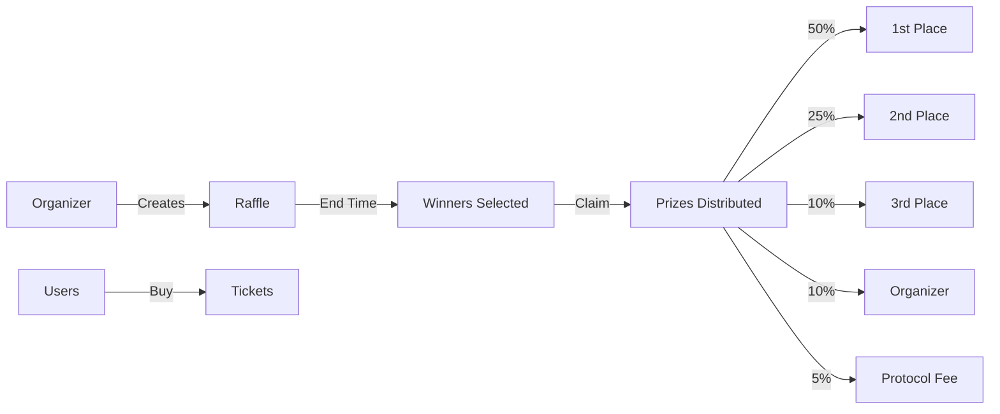
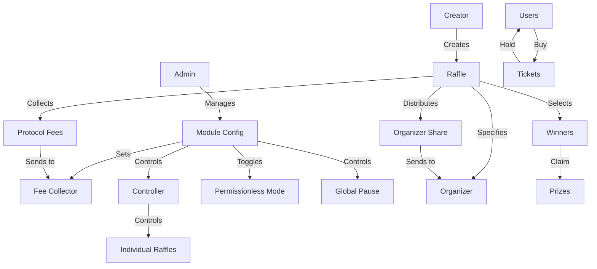

# Sui Raffler

> 🎉 **Create Your Own On-Chain SUI Raffle in Minutes!** 🎉
>
> No coding required to launch your own decentralized raffle on Sui blockchain. Create exciting raffles, let users participate, and watch as winners are automatically selected and rewarded. Join the future of fair and transparent raffles!

A decentralized raffle system built on the Sui blockchain that allows users to create and participate in raffles with automated winner selection and prize distribution.

## Overview

Sui Raffler is a smart contract that enables:

- Creation of raffles with customizable parameters
- Purchase of tickets using SUI tokens
- Automated winner selection using on-chain randomness
- Automatic prize distribution to winners
- Centralized protocol fee collection managed by admin
- Flexible organizer address for receiving organizer's share
- Pause/unpause functionality for both global and individual raffles
- Permissionless mode toggle for raffle creation

### Prize Distribution

- First Prize: 50% of total prize pool
- Second Prize: 25% of total prize pool
- Third Prize: 10% of total prize pool
- Organizer: 10% of total prize pool (sent to specified organizer address)
- Protocol Fee: 5% of total prize pool (sent to fee collector)

## How It Works



### Winning Tickets

The contract provides a built-in function to check winning tickets for any raffle. After a raffle ends and winners are selected, you can:

1. Get the list of all winning ticket numbers
2. Check if a specific ticket is a winner
3. See the prize amount for each winning ticket

This makes it easy for users to verify their tickets and claim their prizes without any manual verification.

## Architecture



## Prerequisites

- Sui CLI installed
- A Sui wallet (e.g., Sui Wallet browser extension)
- Some SUI tokens for testing

## Installation

1. Clone the repository:

```bash
git clone https://github.com/....
cd sui-raffler
```

2. Build the package:

```bash
sui move build
```

3. Deploy the package:

```bash
sui client publish
```

## Usage

### Important Note on SUI Addresses

The following SUI addresses are used in the system:

- Random Object ID: `0x8` - Used for on-chain randomness
- Clock Object ID: `0x6` - Used for time-based operations

### 1. Initialize Module (Admin Only)

```bash
sui client call \
    --package <PACKAGE_ID> \
    --module sui_raffler \
    --function initialize \
    --args <ADMIN_ADDRESS> <CONTROLLER_ADDRESS> <FEE_COLLECTOR_ADDRESS>
```

### 2. Admin Functions

#### Update Admin

```bash
sui client call \
    --package <PACKAGE_ID> \
    --module sui_raffler \
    --function update_admin \
    --args <CONFIG_ID> <NEW_ADMIN_ADDRESS>
```

#### Update Controller

```bash
sui client call \
    --package <PACKAGE_ID> \
    --module sui_raffler \
    --function update_controller \
    --args <CONFIG_ID> <NEW_CONTROLLER_ADDRESS>
```

#### Update Fee Collector

```bash
sui client call \
    --package <PACKAGE_ID> \
    --module sui_raffler \
    --function update_fee_collector \
    --args <CONFIG_ID> <NEW_FEE_COLLECTOR_ADDRESS>
```

#### Set Permissionless Mode

```bash
sui client call \
    --package <PACKAGE_ID> \
    --module sui_raffler \
    --function set_permissionless \
    --args <CONFIG_ID> <true/false>
```

#### Global Pause/Unpause

```bash
# Pause
sui client call \
    --package <PACKAGE_ID> \
    --module sui_raffler \
    --function pause \
    --args <CONFIG_ID>

# Unpause
sui client call \
    --package <PACKAGE_ID> \
    --module sui_raffler \
    --function unpause \
    --args <CONFIG_ID>
```

### 3. Controller Functions

#### Pause/Unpause Individual Raffle

```bash
# Pause
sui client call \
    --package <PACKAGE_ID> \
    --module sui_raffler \
    --function pause_raffle \
    --args <CONFIG_ID> <RAFFLE_ID>

# Unpause
sui client call \
    --package <PACKAGE_ID> \
    --module sui_raffler \
    --function unpause_raffle \
    --args <CONFIG_ID> <RAFFLE_ID>
```

### 4. Create Raffle

```bash
sui client call \
    --package <PACKAGE_ID> \
    --module sui_raffler \
    --function create_raffle \
    --args <CONFIG_ID> <NAME> <DESCRIPTION> <IMAGE> <START_TIME> <END_TIME> <TICKET_PRICE> <MAX_TICKETS_PER_PURCHASE> <ORGANIZER_ADDRESS>
```

### 5. Buy Tickets

```bash
sui client call \
    --package <PACKAGE_ID> \
    --module sui_raffler \
    --function buy_tickets \
    --args <RAFFLE_ID> <PAYMENT_COIN_ID> <NUMBER_OF_TICKETS> <CLOCK_ID>
```

### 6. Release Raffle (After End Time)

```bash
sui client call \
    --package <PACKAGE_ID> \
    --module sui_raffler \
    --function release_raffle \
    --args <CONFIG_ID> <RAFFLE_ID> <RANDOM_ID> <CLOCK_ID>
```

### 7. Claim Functions

#### Claim Prize

```bash
sui client call \
    --package <PACKAGE_ID> \
    --module sui_raffler \
    --function claim_prize \
    --args <RAFFLE_ID> <TICKET_ID>
```

#### Claim Organizer Share

```bash
sui client call \
    --package <PACKAGE_ID> \
    --module sui_raffler \
    --function claim_organizer_share \
    --args <RAFFLE_ID>
```

#### Return Ticket (for raffles with less than 3 tickets)

```bash
sui client call \
    --package <PACKAGE_ID> \
    --module sui_raffler \
    --function return_ticket \
    --args <RAFFLE_ID> <TICKET_ID> <CLOCK_ID>
```

## View Functions

### Get Raffle Information

```bash
sui client call \
    --package <PACKAGE_ID> \
    --module sui_raffler \
    --function get_raffle_info \
    --args <RAFFLE_ID>
```

### Get Winners

```bash
sui client call \
    --package <PACKAGE_ID> \
    --module sui_raffler \
    --function get_winners \
    --args <RAFFLE_ID>
```

### Get Ticket Information

```bash
sui client call \
    --package <PACKAGE_ID> \
    --module sui_raffler \
    --function get_ticket_info \
    --args <TICKET_ID>
```

### Check Winning Ticket

```bash
sui client call \
    --package <PACKAGE_ID> \
    --module sui_raffler \
    --function is_winning_ticket \
    --args <RAFFLE_ID> <TICKET_ID>
```

### Get Raffle Statistics

```bash
sui client call \
    --package <PACKAGE_ID> \
    --module sui_raffler \
    --function get_raffle_stats \
    --args <RAFFLE_ID> <CLOCK_ID>
```

## Security Considerations

- Always verify the raffle parameters before participating
- Ensure you have enough SUI for gas fees
- Keep your private keys secure
- Verify the contract address before interacting
- Be aware that randomness is provided by Sui's on-chain randomness source
- Only the admin can update the fee collector address
- The fee collector address is set during module initialization and cannot be changed by raffle creators
- The organizer address must be a valid address (not @0x0)
- The organizer's share can be claimed at the same time as of winners
- The contract can be paused globally or per raffle by admin/controller
- Permissionless mode can be toggled by admin to control who can create raffles
- Only admin or controller can trigger the raffle release (winners are selected by on-chain randomness)

## Contributing

Contributions are welcome! Please feel free to submit a Pull Request.

## License

This project is licensed under the MIT License - see the LICENSE file for details.
