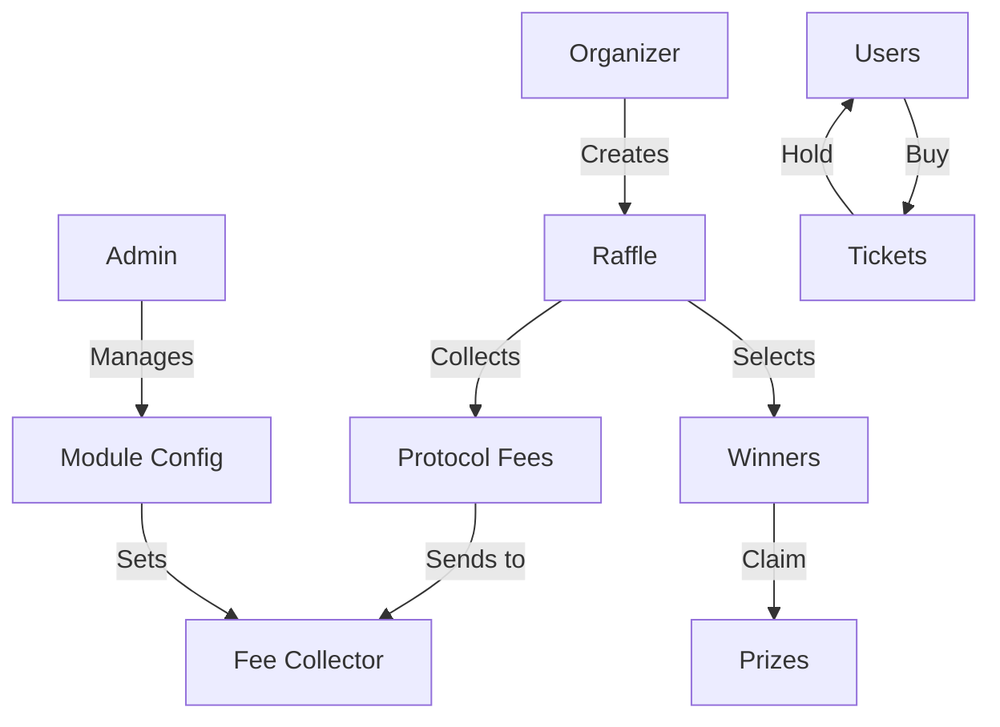

# Sui Raffler

A decentralized raffle system built on the Sui blockchain that allows users to create and participate in raffles with automated winner selection and prize distribution.

## Overview

Sui Raffler is a smart contract that enables:

- Creation of raffles with customizable parameters
- Purchase of tickets using SUI tokens
- Automated winner selection using on-chain randomness
- Automatic prize distribution to winners
- Centralized protocol fee collection managed by admin

### Prize Distribution

- First Prize: 50% of total prize pool
- Second Prize: 25% of total prize pool
- Third Prize: 10% of total prize pool
- Organizer: 10% of total prize pool
- Protocol Fee: 5% of total prize pool

## Architecture



## Prerequisites

- Sui CLI installed
- A Sui wallet (e.g., Sui Wallet browser extension)
- Some SUI tokens for testing

## Installation

1. Clone the repository:

```bash
git clone https://github.com/....
cd sui-raffler
```

2. Build the package:

```bash
sui move build
```

3. Deploy the package:

```bash
sui client publish
```

## Usage

### 1. Initialize Module (Admin Only)

```bash
sui client call \
    --package <PACKAGE_ID> \
    --module sui_raffler \
    --function initialize \
    --args <ADMIN_ADDRESS> <FEE_COLLECTOR_ADDRESS> \
    --gas-budget 10000000
```

### 2. Update Fee Collector (Admin Only)

```bash
sui client call \
    --package <PACKAGE_ID> \
    --module sui_raffler \
    --function update_fee_collector \
    --args <CONFIG_ID> <NEW_FEE_COLLECTOR_ADDRESS> \
    --gas-budget 10000000
```

### 3. Create Raffle

```bash
# Get current timestamp in milliseconds
CURRENT_TIME=$(date +%s%3N)

# Calculate end time (e.g., 1 day from now)
END_TIME=$((CURRENT_TIME + 86400000))  # 86400000 ms = 1 day

sui client call \
    --package <PACKAGE_ID> \
    --module sui_raffler \
    --function create_raffle \
    --args <CONFIG_ID> $CURRENT_TIME $END_TIME 100000000 5 \
    --gas-budget 10000000
```

### 4. Buy Tickets

```bash
sui client call \
    --package <PACKAGE_ID> \
    --module sui_raffler \
    --function buy_tickets \
    --args <RAFFLE_ID> <PAYMENT_COIN_ID> 3 <CLOCK_ID> \
    --gas-budget 10000000
```

### 5. Release Raffle (After End Time)

```bash
sui client call \
    --package <PACKAGE_ID> \
    --module sui_raffler \
    --function release_raffle \
    --args <RAFFLE_ID> <RANDOM_ID> <CLOCK_ID> \
    --gas-budget 10000000
```

### 6. Claim Prize

```bash
sui client call \
    --package <PACKAGE_ID> \
    --module sui_raffler \
    --function claim_prize \
    --args <RAFFLE_ID> <TICKET_ID> \
    --gas-budget 10000000
```

## Time Calculations

Here are some common time calculations for setting raffle start and end times:

```bash
# Current time in milliseconds
CURRENT_TIME=$(date +%s%3N)

# Add time periods
ONE_MINUTE=$((60 * 1000))
ONE_HOUR=$((60 * 60 * 1000))
ONE_DAY=$((24 * 60 * 60 * 1000))
ONE_WEEK=$((7 * 24 * 60 * 60 * 1000))

# Examples
END_TIME_1H=$((CURRENT_TIME + ONE_HOUR))
END_TIME_1D=$((CURRENT_TIME + ONE_DAY))
END_TIME_1W=$((CURRENT_TIME + ONE_WEEK))
```

## View Functions

### Get Raffle Information

```bash
sui client call \
    --package <PACKAGE_ID> \
    --module sui_raffler \
    --function get_raffle_info \
    --args <RAFFLE_ID> \
    --gas-budget 10000000
```

## Testing

Run the test suite:

```bash
sui move test
```

## Security Considerations

- Always verify the raffle parameters before participating
- Ensure you have enough SUI for gas fees
- Keep your private keys secure
- Verify the contract address before interacting
- Be aware that randomness is provided by Sui's on-chain randomness source
- Only the admin can update the fee collector address
- The fee collector address is set during module initialization and cannot be changed by raffle creators

## Contributing

Contributions are welcome! Please feel free to submit a Pull Request.

## License

This project is licensed under the MIT License - see the LICENSE file for details.
